# Beat Saber Extensions For StreamerBot

**Beat Saber Extensions** is a set of StreamerBot commands intended to improve/extend the capabilities of BeatSaberPlus for streamers who broadcast Beat Saber.

## 🚀 Features

* `!bsrlookup` – See if a BSR ID has been played and view the streamer’s score (via BeatLeader API)
* `!bsrmyqueue` / `!bsrwhen` – Check the queue positions of your requests or get an ETA
* `!bsrqueue` – Show the long form song request queue (moderator only)
* `!bsrbump` – Bump a request (with error validation and optional auto-bump for raiders)
* Easily trigger song bump via from other StreamerBot actions (see: [⚡  Triggering Song Bumps From Your Own Actions](#triggering-song-bumps-from-your-own-actions))
* Configurable options for displaying queue entries (BSR Id-only or full beatmap info chosen dynamically based on configuration criterea)

## Table Of Contents

* [📜 Changelog](#-changelog)
* [🛠️ Setup](#️-setup)
  * [📋 Requirements](#-requirements)
  * [📥 Importing Into StreamerBot](#-importing-into-streamerbot)
* [🧵 Commands](#-commands)
  * [🎮 General Chat Commands](#-general-chat-commands)
  * [🛡️ Moderator-Only Commands](#️-moderator-only-commands)
* [⚡  Triggering Song Bumps From Your Own Actions](#triggering-song-bumps-from-your-own-actions)
* [📦 User-Configurable Messages & Settings](#-user-configurable-messages--settings)
* [📝 Logging](#-logging)
* [🧪 Building/Modifying](#-buildingmodifying)
  * [💻 Editing In External IDEs](#-editing-in-external-ides)
* [🧯 Troubleshooting](#troubleshooting)

## 📜 Changelog

### [0.1.2] - 2025-07-12

* Fixed various edge-cases related to the automatic raid request bump functionality
  * Fix for StreamerBot edge case where certain BSR Ids from raid request command input being parsed incorrectly
  * Added check for if the request is already in the queue for a different user
  * Added special handling for when the queue is closed using `!att`
* Added the ability to trigger song bumps from any StreamerBot action

### [0.1.1] - 2025-06-06

* Fixed missing triggers related to raid requests
* Added configurable `DefaultQueueItemCount`
* Refactored Logger

> [!Note]
> I have identified an issue where the BeatLeader API will sometimes return `401 Unauthorized` causing `!bsrlookup` to fail and I'm currently working on a fix

### [0.1.0] - 2025-06-01

* Added user-configurable values via StreamerBot arguments
* `!bsrlookup`: Now properly locates the most recent score rather than just the user's top/pinned score for a beatmap
* Additional edge case validation during song bumps with appropriate error messages
* Automatic bumping for song requests from raiders (*Optional*, can be enabled via user-configurable setting).
* New commands `!bsrenable`/`!bsrdisable`: Allows the broadcaster or a moderator to enable or disable all non-moderator commands provided by this module (for example, if the streamer is not currently playing Beat Saber)

## 🛠️ Setup

### 📋 Requirements

* StreamerBot 0.2.4 or later
* BeatSaberPlus Beat Saber Plugin (tested with version `6.4.0`, but should work with earlier versions)
* BeatLeader profile (for `!bsrlookup` command)

### 📥 Importing Into StreamerBot

* Copy StreamerBot Import String from [StreamerBot Import File](Beat%20Saber%20Extensions%20For%20StreamerBot.sb) and paste into the `Import` menu in StreamerBot (or download the file and click+drag it into the import window).
* Commands will be imported in a disabled state, so you will need to navigate to the `Commands` tab and enable all of the commands. They can all be found in the `Chat Commands - Beat Saber Extensions` subgroup in the commands tab.
* Check the [Troubleshooting](#troubleshooting) section if you run into any issues.

* Notes:
  * **Beat Saber Extensions** will not initially know the location of your Beat Saber install, but it will automatically detect it the first time that one of the commands gets used while Beat Saber is running. This setting is stored in a global variable, and is updated automatically when the path associated with the currently running `Beat Saber.exe` process is detected to have changed.
  * **Beat Saber Extensions** will not initially know the streamer's BeatLeader ID. The first time the `!bsrlookup` command is used, it will attempt to determine the streamer's BeatLeader ID by triggering the `!bsprofile` BeatSaberPlus command.

## 🧵 Commands

> [!Note]
> Typically, when autocompleting the username for a chatter with a localized display name (Japanese/Chinese/Russian/etc.), most chat clients will autocomplete the user's display name. StreamerBot cannot identify users by display name alone, but **Beat Saber Extensions** automatically identifies users with special display names and keeps track of them using StreamerBot user groups so that localized display names can be used as input for commands.

For commands accepting a `User` argument (`!bsrmyqueue`, `!bsrwhen`, `!bsrbump`), you can provide either a username or a display name. Names may be provided with or without the `@` prefix.

### 🎮 General Chat Commands

#### `!bsrmyqueue [user]` (Alias: `!bsrmq`)

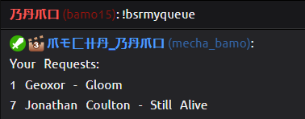

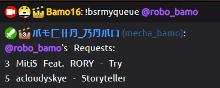

#### `!bsrwhen [user]`

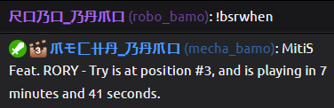

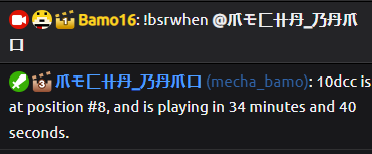

### `!bsrlookup <bsrid>`

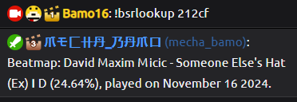

### 🛡️ Moderator-Only Commands

### `!bsrbump <bsrid|user>`

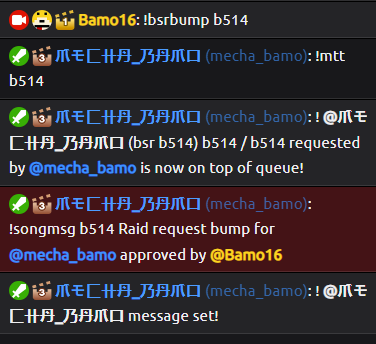

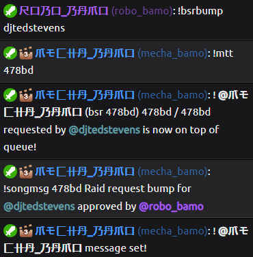

### `!bsrqueue [count]`

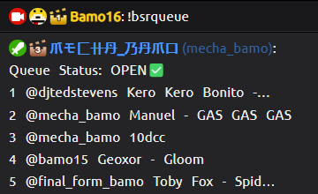

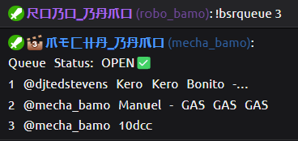

### `!bsrdisable`

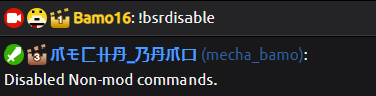

### `!bsrenable`

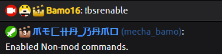

### `!bsrextversion`

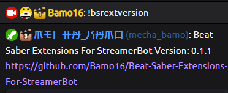

## Triggering Song Bumps From Your Own Actions

You can trigger a song bump from any of your own StreamerBot actions. The only requirement is that your action must populate the `user` argument with a valid username. Any StreamerBot trigger related to user activiaty (Channel Reward Redemption for example) will always populate this argument automatically, so for most trigger types, you shouldn't need to configure arguments at all.

To trigger a raid bump for your action, simply add an `Execute C# Method` sub-action to your action. This is all that's needed to have your action trigger a song bump for the user who triggered your action (e.g. for a Channel Reward Redemption trigger, it willbe the user who used the redeem).

If the user has multiple requests in the queue, the most recently added request will be bumped. If you'd like some sort of different bump behavior besides most recently added (like bumping a specific beatmap ID), I'd be happy to add some options if you let me know via a GitHub issue (or pester me when I'm live at <https://www.twitch.tv/bamo16>).

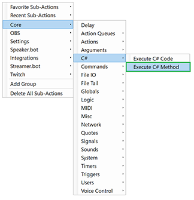

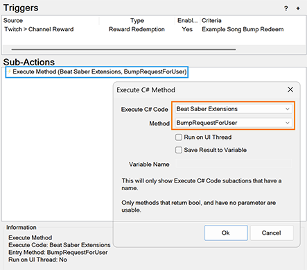

## 📦 User-Configurable Messages & Settings

### Response Messages

Argument Name                 | Description                                                                              | Default Value
----------------------------- | ---------------------------------------------------------------------------------------- | ----------------------------------------------------------------------------------------
`NotConfiguredMessage`        | Displayed when the action is used without ever starting Beat Saber                       | `The BeatSaber.BeatSaberRoot global variable is not currently configured. Please try running this command again while BeatSaber is running, and the variable will be set automatically.`
`QueueEmptyMessage`           | Displayed by `!bsrmyqueue` and `!bsrwhen` when the queue is empty.                       | `There aren't currently any songs in the queue.`
`NonModeratorBumpMessage`     | Displayed when `!bsrbump` is used by a non-moderator.                                    | `Only moderators can use the !bsrbump command.🚫`
`BlankInputBumpMessage`       | Displayed when `!bsrbump` is used without providing any input.                           | `You must provide either a BSR Id, username, or displayname for the !bsrbump command.🚫`
`FailedToGetBeatLeaderIdMessage` | Displayed when an attempt to retrieve the player's BeatLeader ID fails.               | `Failed to get BeatLeader Id from BeatSaberPlus.`
`LookupMissingBsrIdMessage`   | Displayed when `!bsrlookup` command is used without providing any input.                 | `You must provide a BSR Id with !bsrlookup.`
`QueueStatusOpenMessage`      | Displayed at the beginning of the `!bsrqueue` command's output when the queue is open.   | `Queue Status: OPEN✅`
`QueueStatusClosedMessage`    | Displayed at the beginning of the `!bsrqueue` command's output when the queue is closed. | `Queue Status: CLOSED🚫`
`StateCommandEnabledMessage`  | Displayed when the `!bsrenable` command is used.                                         | `Enabled Non-mod commands.`
`StateCommandDisabledMessage` | Displayed when the `!bsrenable` command is used.                                         | `Disabled Non-mod commands.`
`RaidRequestBumpMessage`      | Displayed as the song message attached to a bumped raid request.                         | `Raid request bump`


### Response Format Strings

Argument Name                | Description                                                                      | Default Value
---------------------------- | -------------------------------------------------------------------------------- | --------------------------------------------------------------------------------------------
`InvalidInputBumpFormat`     | Displayed when the `!basrbump` command is used with an argument that does not match any user or BSR ID. | `The provided value (\"{0}\") does not match any queued BSR Id, username, or displayname.🚫`
`NoUserRequestsBumpFormat`   | Displayed when the `!basrbump` command is used to bump someone with no requests. | `There currently aren't any requests in the queue for {0}`
`SongBumpFailureFormat`      | Displayed when the `!bsrbump` command is not able to confirm success.            | `Couldn't verify song bump success. Please confirm that {0} was bumped to the top.⚠️`
`SongMessageFormat`          | Template used to format the song message used with a song bump.                  | `!songmsg {0} {1} for {2} approved by {3}`
`LookupInvalidBsrIdFormat`   | Used when an invalid BSR ID is provided to `!bsrlookup`.                         | `Invalid beatmap id: \"{0}\".`
`LookupBeatmapNoFoundFormat` | Displayed when there is no beatmap associated with a BSRID            | `Failed to find beatmap for id: "{0}".`
`UserHasNoRequestsFormat`    | Used when `!bsrwhen`, `!bsrmyqueue`, or `!bsrbump` is used for a user with no requests in the queue. | `{0} {1} not currently have any requests in the queue.`
`LookupNoRecentScoresFormat` | Used when the `!bsrlookup` command is called with a valid BSR ID, but no recent scores were found for the user. | `Didn't find any recent scores by {0} on {1}.`
`LookupScoreResultFormat`    | Used to format the output the score from a successful `!bsrlookup` command.      | `Beatmap: {0} ({1}) ❙ {2}, played {3}.`
`WhenMessageFormat`          | Used to format the output of the `!bsrwhen` command.                             | `{0} is at position #{1}, and is playing in {2}.`


### Song Bump Configuration Setttings

Argument Name                     | Description                                                                                 | Default Value
--------------------------------- | ------------------------------------------------------------------------------------------- | -------------
`BumpValidationAttempts`          | How many times to attempt to validate if a song bump was processed.                         | `3`
`BumpValidationDelayMs`           | Delay (in ms) between bump validation attempts.                                             | `4000`
`BumpNextRequestFromRaider`       | When set to `true`, the first request from a raider will be bumped to the top of the queue. | `false`
`ClearRaidRequestorsAfterMinutes` | When `BumpNextRequestFromRaider` is `true`, this setting determines how long a raid requestor will be remembered (in minutes) if the stream goes offline. | `30`


### General Configuration Setttings

Argument Name                 | Description                                                           | Default Value
----------------------------- | --------------------------------------------------------------------- | -------------
`UsernameDisplayMode`         | Specifies how usernames are shown. `UserLoginOnly`: "mecha_bamo", `DisplayNameOnlu`: "爪モ匚卄丹_乃丹爪口", or `Dynamic` "mecha_bamo (爪モ匚卄丹_乃丹爪口)". | `UserLoginOnly`
`DefaultQueueItemCount`       | Default number of items that can be shown by the `!bsrqueue` command. | `5`
`MaximumQueueItemCount`       | Maximum number of items that can be shown by the `!bsrqueue` command. | `10`
`BeatmapCacheDurationMinutes` | Duration (minutes) to cache beatmap data.                             | `30`
`SecondsBetweenSongs`         | When calculating the estimated wait time for `!bsrwhen`, this is the amount of time added to each song to accommodate for time spent in menus or talking to chat. | `90`


### Beatmap Safe Mode Display Options

The configuration options below control how beatmap info will be displayed when using commands that output beatmap information to chat. If a beatmap does not meet the criterea, then only the BSR ID will be shown. Otherwise, a combination of  `SongAuthorName` and `SongName` will be used.

Argument Name            | Description                                                                             | Default Value
------------------------ | --------------------------------------------------------------------------------------- | -------------
`AlwaysShowWhenCurated`  | When set to `true`, any beatmap marked as being curated will be considered safe to display (regardless of other criterea). | `true`
`MinimumimumAgeDays`     | Beatmaps uploaded more recently than this value will not have full beatmap info shown.  | `7`
`MinimumScore`           | Beatmaps with a score less than this value will not have full beatmap info shown.       | `0.65`
`MinimumUpvotes`         | Beatmaps with fewer upvotes than this value will not have full beatmap info shown.      | `500`
`MinimumDurationSeconds` | Beatmaps with a duration shorter than this value will not have full beatmap info shown. | `90`

## 📝 Logging

You can find log messages related to **Beat Saber Extensions** in the StreamerBot log file. Messages will always start with `[Beat Saber Extensions]`

## 🧪 Building/Modifying

### 💻 Editing In External IDEs

If you'd like to edit this code in some way, you'll likely want to load it in your IDE of choice.

🧵 **Recommended reading:**  
[Writing Streamer.bot C# code with linting in Visual Studio Code](https://gist.github.com/rondhi/aa5e8c3b7d1277d1c93dd7f486b596fe "Github Gist by rondhi")

The project's `.csproj` files are set up to load the required StreamerBot assemblies (like `Streamer.bot.Plugin.Interface`), but they won’t resolve unless you specify the path. They will attempt to use a property called `DotnetAssembliesPath` to find these files. To define a value for `DotnetAssembliesPath`, create a`Directory.Build.props` file in both:

* `/BeatSaberExtensions/BeatSaberExtensions`
* `/BeatSaberExtensions/GroupManager`

**Example:**

```xml
<Project>
    <PropertyGroup>
        <!-- Replace this with the path to the root of your StreamerBot folder (where the .exe is) -->
        <DotnetAssembliesPath>P:\RYAN\Streaming\Dotnet Assemblies</DotnetAssembliesPath> 
    </PropertyGroup>
</Project>
```

Note: The code contained in the **Beat Saber Extensions** Execute C# Code subaction is spread across multiple project files which need to be merged into one to paste into StreamerBot. I am unfortunatelly not ready to share the build tool which performs this task, but I will try to share it in the future.

## Troubleshooting

* If StreamerBot shows compiler errors for one or both Execute C# SubActions
  * This is likely due to missing references. StreamerBot should load these automatically on import, but if it does not for some reason, here are the needed references for each action. You can add each one my opening the Execute C# SubAction and navigating to the References tab:
    * **Beat Saber Extensions**
      * `mscorelib.dll`
      * `System.dll`
      * `System.Core.dll`
      * `System.Net.Http.dll`
      * `System.Web.dll`
    * **Group Manager**
      * `mscorelib.dll`
      * `System.dll`
      * `System.Core.dll`
