# Beat Saber Extensions For StreamerBot

**Beat Saber Extensions** is a set of StreamerBot commands intended to improve/extend the capabilities of BeatSaberPlus for streamers who broadcast Beat Saber.

## 🚀 Features

* `!bsrmyqueue` / `!bsrwhen` – Check the queue positions of your requests or get an ETA
* `!bsrqueue` – Show the long form song request queue (moderator only when used in Twitch chat)
* `!bsrbump` – Bump a request (with error validation and optional auto-bump for raiders)
* `!bsrlookup` – See if a BSR ID has been played and view the streamer’s score via the BeatLeader API (work in progress)
* Commands can be sent via Twitch chat, or whisper to the bot account (see: [📩 Responses via Bot Whispers](#-responses-via-bot-whispers))
* Easily trigger song bump via from other StreamerBot actions (see: [⚡ Triggering Song Bumps From Your Own Actions](#-triggering-song-bumps-from-your-own-actions))
* Configurable options for displaying queue entries (BSR Id-only or full beatmap info chosen dynamically based on configuration criterea)

## Table Of Contents

* [📜 Changelog](#-changelog)
* [🚀 Features](#-features)
* [🛠️ Setup](#️-setup)
  * [📋 Requirements](#-requirements)
  * [📥 Importing Into StreamerBot](#-importing-into-streamerbot)
* [🧵 Commands](#-commands)
  * [🎮 General Chat Commands](#-general-chat-commands)
  * [🛡️ Moderator-Only Commands](#️-moderator-only-commands)
  * [🪵 Log Inspection](#-log-inspection)
* [📩 Responses via Bot Whispers](#-responses-via-bot-whispers)
* [⚡ Triggering Song Bumps From Your Own Actions](#-triggering-song-bumps-from-your-own-actions)
* [📁 Configuration File](#-configuration-file)
* [📦 Configurable Messages \& Settings](#-configurable-messages--settings)
* [📝 Logging](#-logging)
* [🧪 Building/Modifying](#-buildingmodifying)
* [🔧 Troubleshooting](#-troubleshooting)

## 📜 Changelog

### [0.2.0] - 2026-05-08

* **Breaking change**: configuration moved from StreamerBot action arguments to `BeatSaberExtensions.config.json` in the StreamerBot folder. See [📁 Configuration File](#-configuration-file).
* Fixed BeatSaberPlus blacklist not being honored due to a JSON field rename (`blacklist` → `blocklist`). Thanks @HakuTheWolfSpirit (#5).
* Fixed `NullReferenceException` in `!bsrwhen` when a queued beatmap couldn't be fetched from BeatSaver.
* Fixed `SecondsBetweenSongs` not being applied to the `!bsrwhen` wait estimate.
* Fixed `AllowBotWhispers`, `KeepRecentErrorCount`, and `!bsrlogs show <index>` not actually honoring their values.
* Simplified the BeatSaver cache: failed refreshes now retain the existing entry instead of dropping it.
* Documented the `!bsrlogs` command.
* Renamed config keys to drop typos: `KeeoRecentErrorCount` → `KeepRecentErrorCount`, `MinimumimumAgeDays` → `MinimumAgeDays`.

### [0.1.3] - 2025-09-09

* Updated for StreamerBot 1.0.0 release
* Improved the handling of DateTimes stored in global variables
* Fixed bug where raid requests were not bumped due to race condition
* Added new command `!bsrlast` for getting a link to the last played beatmap after the player has already started playing a new beatmap
* Added new configuration setting: `AllowBotWhispers`
* Improved edge-case handling for raid requests and added a fallback to `!att` when a raid request is rejected due to the queue being closed or any other reason
* When the bot adds a beatmap using `!att`, it will now be added on behalf of the actual requestor so the user's name is shown in the queue instead of the bot's name

### [0.1.2] - 2025-07-12

* Fixed various edge-cases related to the automatic raid request bump functionality
  * Fix for StreamerBot edge case where certain BSR Ids from raid request command input being parsed incorrectly
  * Added check for if the request is already in the queue for a different user
  * Added special handling for when the queue is closed using `!att`
* Added the ability to trigger song bumps from any StreamerBot action

### [0.1.1] - 2025-06-06

* Fixed missing triggers related to raid requests
* Added configurable `DefaultQueueItemCount`
* Refactored Logger

## 🛠️ Setup

### 📋 Requirements

* StreamerBot 0.2.4 or later
* BeatSaberPlus Beat Saber Plugin (tested with version `6.4.0`, but should work with earlier versions)
* BeatLeader profile (for `!bsrlookup` command)

### 📥 Importing Into StreamerBot

* Copy StreamerBot Import String from [StreamerBot Import File](BeatSaberExtensions.sb) and paste into the `Import` menu in StreamerBot (or download the file and click+drag it into the import window).
* Commands will be imported in a disabled state, so you will need to navigate to the `Commands` tab and enable all of the commands. They can all be found in the `Chat Commands - Beat Saber Extensions` subgroup in the commands tab.
* The first time any command runs, **Beat Saber Extensions** will create a `BeatSaberExtensions.config.json` file in your StreamerBot folder (alongside the `.exe`). This file holds every user-configurable message and setting. See [📁 Configuration File](#-configuration-file) for details.
* Check the [🔧 Troubleshooting](#-troubleshooting) section if you run into any issues.

* Notes:
  * **Beat Saber Extensions** will not initially know the location of your Beat Saber install, but it will automatically detect it the first time that one of the commands gets used while Beat Saber is running. This setting is stored in a global variable, and is updated automatically when the path associated with the currently running `Beat Saber.exe` process is detected to have changed.
  * **Beat Saber Extensions** will not initially know the streamer's BeatLeader ID. The first time the `!bsrlookup` command is used, it will attempt to determine the streamer's BeatLeader ID by triggering the `!bsprofile` BeatSaberPlus command.

## 🧵 Commands

For commands accepting a `User` argument (`!bsrmyqueue`, `!bsrwhen`, `!bsrbump`), you can provide either a username or a display name. Names may be provided with or without the `@` prefix.

### 🎮 General Chat Commands

#### `!bsrmyqueue [user]` (Alias: `!bsrmq`)

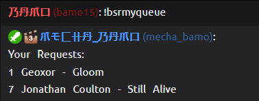

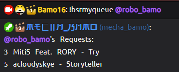

#### `!bsrwhen [user]`

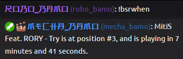

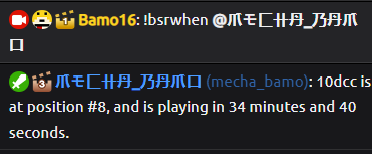

#### `!bsrlast`

#### `!bsrqueue [count]`

> [!NOTE]
> The `bsrqueue` command can be used via bot whispers by any user (see: [📩 Responses via Bot Whispers](#-responses-via-bot-whispers)), or in Twitch chat by moderators only.

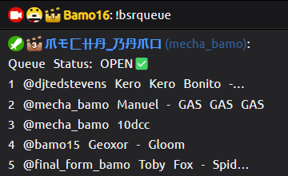

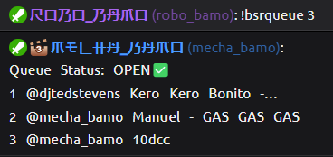

#### `!bsrlookup <bsrid>`

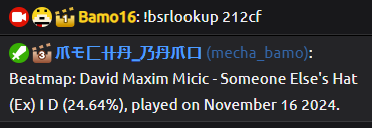

### 🛡️ Moderator-Only Commands

#### `!bsrbump <bsrid|user>`

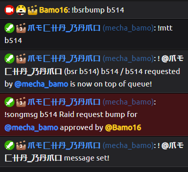

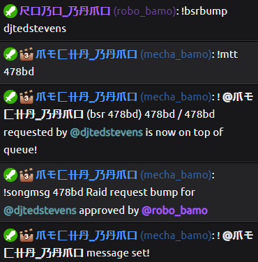

#### `!bsrdisable`

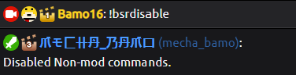

#### `!bsrenable`

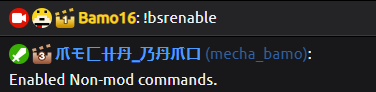

#### `!bsrextversion`

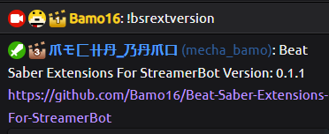

> [!Note]
> Typically, when autocompleting the username for a chatter with a localized display name (Japanese/Chinese/Russian/etc.), most chat clients will autocomplete the user's display name. StreamerBot cannot identify users by display name alone, but **Beat Saber Extensions** automatically identifies users with special display names and keeps track of them using StreamerBot user groups so that localized display names can be used as input for commands.

### 🪵 Log Inspection

#### `!bsrlogs <subcommand>`

The `!bsrlogs` command lets trusted users inspect recent **Beat Saber Extensions** error messages without needing access to the StreamerBot log file. By default, the command is gated by StreamerBot to moderators and members of the `BSR Extensions Log Users` group.

| Subcommand              | Description |
| ----------------------- | ----------- |
| `show [index]`          | Show a recent exception. `index` is `0` for the most recent (the default), `1` for the next most recent, and so on. The number of exceptions retained is controlled by the `KeepRecentErrorCount` setting. |
| `add <user>`            | Add a user to the `BSR Extensions Log Users` group so they can use `!bsrlogs`. Moderators and existing group members can add users. |
| `remove <user>`         | Remove a user from the `BSR Extensions Log Users` group. |

## 📩 Responses via Bot Whispers

> [!IMPORTANT]
> Please note that Twitch only allows accounts with verified phone numbers to send whispers. There are also a number of other limitations which you can read about on this StreamerBot documentation page: [Whispers | Streamer.bot Docs](https://docs.streamer.bot/api/triggers/twitch/chat/whispers/ "Whispers | Streamer.bot Docs").

The bot will only respond via whisper if `AllowBotWhispers` is set to `True` in [General Configuration Settings](#general-configuration-settings) (this is the default) and the user sent a valid command to the bot via Twitch whisper. **Beat Saber Extensions** will *never* send unsolicited whispers to any user.

## ⚡ Triggering Song Bumps From Your Own Actions

You can trigger a song bump from any of your own StreamerBot actions. The only requirement is that your action must populate the `user` argument with a valid username. Any StreamerBot trigger related to user activiaty (Channel Reward Redemption for example) will always populate this argument automatically, so for most trigger types, you shouldn't need to configure arguments at all.

To trigger a raid bump for your action, simply add an `Execute C# Method` sub-action to your action. This is all that's needed to have your action trigger a song bump for the user who triggered your action (e.g. for a Channel Reward Redemption trigger, it willbe the user who used the redeem).

If the user has multiple requests in the queue, the most recently added request will be bumped. If you'd like some sort of different bump behavior besides most recently added (like bumping a specific beatmap ID), I'd be happy to add some options if you let me know via a GitHub issue (or pester me when I'm live at <https://www.twitch.tv/bamo16>).

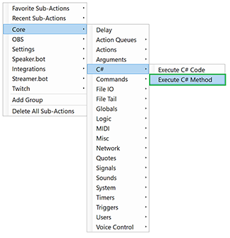

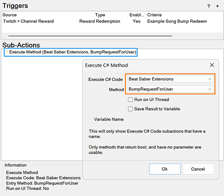

## 📁 Configuration File

Starting with version `0.2.0`, all user-configurable messages and settings live in a JSON file at the root of your StreamerBot folder (next to `Streamer.bot.exe`):

```
<StreamerBot folder>/BeatSaberExtensions.config.json
```

The file is created automatically on the first invocation of any **Beat Saber Extensions** command. It is populated with every setting at its default value, so you can open it in a text editor and see the full schema right away.

* The file is reloaded on every command invocation, but the read is `mtime`-gated, so unchanged files do not trigger any re-parse work. Edits you make take effect on the next command.
* If a key is missing from your file, the documented default is used.
* If the file contains JSON that fails to parse, **Beat Saber Extensions** logs a warning and continues using the previously loaded values (or defaults on first run); no action is required to recover beyond fixing the JSON.
* If you want to reset to defaults, delete the file and the next command invocation will regenerate it.

> [!IMPORTANT]
> **Upgrading from 0.1.x:** the old workflow stored these values as StreamerBot action arguments. Importing 0.2.0 does not migrate those values. After importing, edit `BeatSaberExtensions.config.json` to match any settings you had previously customized.

## 📦 Configurable Messages & Settings

The tables below list every key supported in `BeatSaberExtensions.config.json` along with its default value.

### Response Messages

Setting Name                  | Description                                                                              | Default Value
----------------------------- | ---------------------------------------------------------------------------------------- | ----------------------------------------------------------------------------------------
`NotConfiguredMessage`        | Displayed when the action is used without ever starting Beat Saber                       | `The BeatSaber.BeatSaberRoot global variable is not currently configured. Please try running this command again while BeatSaber is running, and the variable will be set automatically.`
`QueueEmptyMessage`           | Displayed by `!bsrmyqueue` and `!bsrwhen` when the queue is empty.                       | `There aren't currently any songs in the queue.`
`NonModeratorBumpMessage`     | Displayed when `!bsrbump` is used by a non-moderator.                                    | `Only moderators can use the !bsrbump command.🚫`
`BlankInputBumpMessage`       | Displayed when `!bsrbump` is used without providing any input.                           | `You must provide either a BSR Id, username, or displayname for the !bsrbump command.🚫`
`FailedToGetBeatLeaderIdMessage` | Displayed when an attempt to retrieve the player's BeatLeader ID fails.               | `Failed to get BeatLeader Id from BeatSaberPlus.`
`LookupMissingBsrIdMessage`   | Displayed when `!bsrlookup` command is used without providing any input.                 | `You must provide a BSR Id with !bsrlookup.`
`QueueStatusOpenMessage`      | Displayed at the beginning of the `!bsrqueue` command's output when the queue is open.   | `Queue Status: OPEN✅`
`QueueStatusClosedMessage`    | Displayed at the beginning of the `!bsrqueue` command's output when the queue is closed. | `Queue Status: CLOSED🚫`
`StateCommandEnabledMessage`  | Displayed when the `!bsrenable` command is used.                                         | `Enabled Non-mod commands.`
`StateCommandDisabledMessage` | Displayed when the `!bsrenable` command is used.                                         | `Disabled Non-mod commands.`
`RaidRequestBumpMessage`      | Displayed as the song message attached to a bumped raid request.                         | `Raid request bump`


### Response Format Strings

Setting Name                 | Description                                                                      | Default Value
---------------------------- | -------------------------------------------------------------------------------- | --------------------------------------------------------------------------------------------
`InvalidInputBumpFormat`     | Displayed when the `!basrbump` command is used with an argument that does not match any user or BSR ID. | `The provided value (\"{0}\") does not match any queued BSR Id, username, or displayname.🚫`
`NoUserRequestsBumpFormat`   | Displayed when the `!basrbump` command is used to bump someone with no requests. | `There currently aren't any requests in the queue for {0}`
`SongBumpFailureFormat`      | Displayed when the `!bsrbump` command is not able to confirm success.            | `Couldn't verify song bump success. Please confirm that {0} was bumped to the top.⚠️`
`SongMessageFormat`          | Template used to format the song message used with a song bump.                  | `!songmsg {0} {1} for {2} approved by {3}`
`LookupInvalidBsrIdFormat`   | Used when an invalid BSR ID is provided to `!bsrlookup`.                         | `Invalid beatmap id: \"{0}\".`
`LookupBeatmapNoFoundFormat` | Displayed when there is no beatmap associated with a BSRID            | `Failed to find beatmap for id: "{0}".`
`UserHasNoRequestsFormat`    | Used when `!bsrwhen`, `!bsrmyqueue`, or `!bsrbump` is used for a user with no requests in the queue. | `{0} {1} not currently have any requests in the queue.`
`LookupNoRecentScoresFormat` | Used when the `!bsrlookup` command is called with a valid BSR ID, but no recent scores were found for the user. | `Didn't find any recent scores by {0} on {1}.`
`LookupScoreResultFormat`    | Used to format the output the score from a successful `!bsrlookup` command.      | `Beatmap: {0} ({1}) ❙ {2}, played {3}.`
`WhenMessageFormat`          | Used to format the output of the `!bsrwhen` command.                             | `{0} is at position #{1}, and is playing in {2}.`


### General Configuration Settings

Setting Name                  | Description                                                           | Default Value
----------------------------- | --------------------------------------------------------------------- | -------------
`AllowBotWhispers`            | Controls if the bot should also respond to commands via whispers (allows !bsrqueue in whispers for non-mods). | `true`
`UsernameDisplayMode`         | Specifies how usernames are shown. `UserLoginOnly`: "mecha_bamo", `DisplayNameOnly`: "爪モ匚卄丹_乃丹爪口", or `Dynamic`: "mecha_bamo (爪モ匚卄丹_乃丹爪口)". | `UserLoginOnly`
`DefaultQueueItemCount`       | Default number of items that can be shown by the `!bsrqueue` command. | `5`
`MaximumQueueItemCount`       | Maximum number of items that can be shown by the `!bsrqueue` command. | `10`
`BeatmapCacheDurationMinutes` | Duration (minutes) to cache beatmap data.                             | `30`
`SecondsBetweenSongs`         | When calculating the estimated wait time for `!bsrwhen`, this is the amount of time added to each song to accommodate for time spent in menus or talking to chat. | `90`
`KeepRecentErrorCount`        | Number of recent error messages to retain for the `!bsrlogs show` command. | `10`

### Song Bump Configuration Settings

Setting Name                      | Description                                                                                 | Default Value
--------------------------------- | ------------------------------------------------------------------------------------------- | -------------
`BumpValidationAttempts`          | How many times to attempt to validate if a song bump was processed.                         | `3`
`BumpValidationDelayMs`           | Delay (in ms) between bump validation attempts.                                             | `4000`
`BumpNextRequestFromRaider`       | When set to `true`, the first request from a raider will be bumped to the top of the queue. | `false`


### Beatmap Safe Mode Display Options

The configuration options below control how beatmap info will be displayed when using commands that output beatmap information to chat. If a beatmap does not meet the criterea, then only the BSR ID will be shown. Otherwise, a combination of  `SongAuthorName` and `SongName` will be used.

Setting Name             | Description                                                                             | Default Value
------------------------ | --------------------------------------------------------------------------------------- | -------------
`AlwaysShowWhenCurated`  | When set to `true`, any beatmap marked as being curated will be considered safe to display (regardless of other criterea). | `true`
`MinimumAgeDays`         | Beatmaps uploaded more recently than this value will not have full beatmap info shown.  | `7`
`MinimumScore`           | Beatmaps with a score less than this value will not have full beatmap info shown.       | `0.65`
`MinimumUpvotes`         | Beatmaps with fewer upvotes than this value will not have full beatmap info shown.      | `500`
`MinimumDurationSeconds` | Beatmaps with a duration shorter than this value will not have full beatmap info shown. | `90`

## 📝 Logging

You can find log messages related to **Beat Saber Extensions** in the StreamerBot log file. Messages will always start with `[Beat Saber Extensions]`

## 🧪 Building/Modifying

### 💻 Editing In External IDEs

If you'd like to edit this code in some way, you'll likely want to open it in your IDE of choice.

🧵 **Recommended reading:**  
[Writing Streamer.bot C# code with linting in Visual Studio Code](https://gist.github.com/rondhi/aa5e8c3b7d1277d1c93dd7f486b596fe "Github Gist by rondhi")

The `.csproj` file is set up to load the required StreamerBot assemblies (like `Streamer.bot.Plugin.Interface`), but they won’t resolve unless you specify the path. It will attempt to use a property called `DotnetAssembliesPath` to find these files. To define a value for `DotnetAssembliesPath`, create a`Directory.Build.props` file in `/BeatSaberExtensions/BeatSaberExtensions`.

**Example:**

```xml
<Project>
    <PropertyGroup>
        <!-- Replace this with the path to the root of your StreamerBot folder (where the .exe is) -->
        <DotnetAssembliesPath>P:\RYAN\Streaming\Dotnet Assemblies</DotnetAssembliesPath> 
    </PropertyGroup>
</Project>
```

Note: The code contained in the **Beat Saber Extensions** Execute C# Code subaction is spread across multiple project files which need to be merged into one to paste into StreamerBot. I am unfortunatelly not ready to share the build tool which performs this task, but I will try to share it in the future.

## 🔧 Troubleshooting

* If StreamerBot shows compiler errors for the Execute C# SubAction, this is likely due to missing references. StreamerBot should load these automatically on import, but if it does not for some reason, here are the needed references for each action. You can add each one my opening the Execute C# SubAction and navigating to the References tab:
  * `mscorelib.dll`
  * `System.dll`
  * `System.Core.dll`
  * `System.Net.Http.dll`
  * `System.Web.dll`
